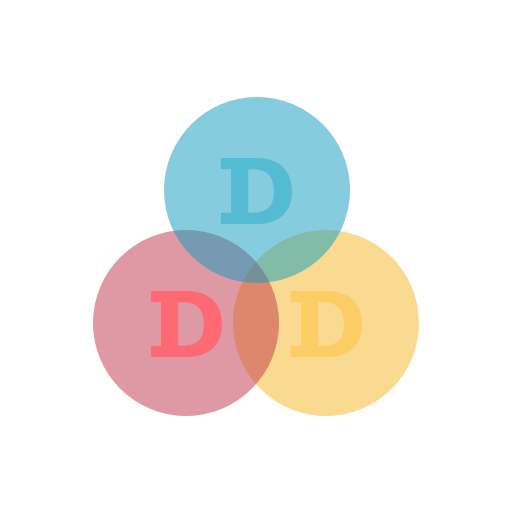
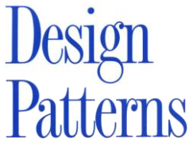
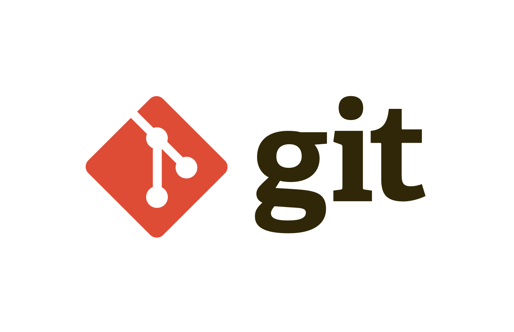
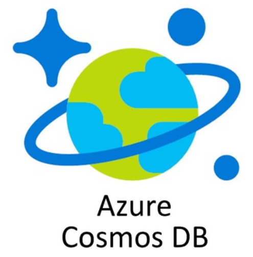
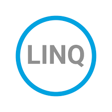

### Hi there 👋
As a Back-end Engineer, I'm driven by a relentless pursuit of continuous learning and the excitement of solving complex challenges. I help companies to improve performance and scalability by building microservices and APIs and coding readable and testable software.

Check out the principal repository of my portfolio [CQRS Showcase](https://github.com/reinaldogez/cqrs-showcase), which is currently under development.

## Skills & Technologies:

 
   
   
   
  
  
  
  
   
  
  
  
   
   
   
   
   
   
   
  

